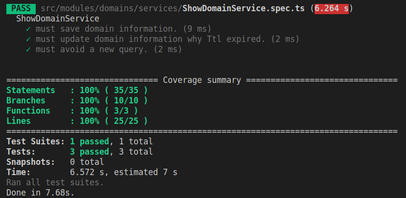

# Umbler challenge 


- // TODO: Project exaplained with video on YouTube.

## / Root of the project
 
** Read the readme in `./backend` and`./frontend` they have all the basic project documentation.

### Cheat Sheet - docker-compose

- Create and start containers
```bash
docker-compose up
```

- Start services with detached mode
```bash
docker-compose -d up
```

- Start specific service
```bash
docker-compose up <service-name>
```

- List images
```bash
docker-compose images
```

- List containers
```bash
docker-compose ps
```

- Start service
```bash
docker-compose start
```

- Stop services
```bash
docker-compose stop
```

- Display running containers
```bash
docker-compose top
```

- Kill services
```bash
docker-compose kill
```

- Remove stopped containers
```bash
docker-compose rm
```

- Stop all contaners and remove images, volumes
```bash
docker-compose down
```